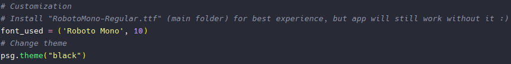
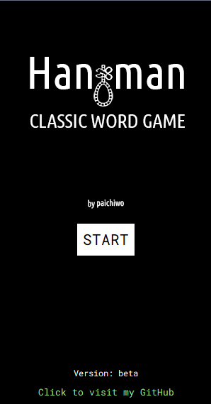
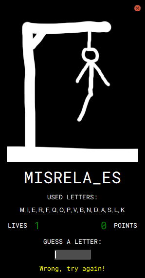

## **Hangman Game**

Hangman is a classic word guessing game known around the world. I took my own approach to building this addictive game using the Python programming language. The game uses [http://random-word-api.herokuapp.com/homean](http://random-word-api.herokuapp.com/home). The API contains more than 170,000 words to guess, and a “live” image of a hangman is displayed as the player makes incorrect guesses. After completing a round, the program will also ask if the user wants to find the meaning of a guessed (or not) word.

## Getting Started

These instructions will get you a copy of the project up and running on your local machine for development and testing purposes or just pure fun.

## Prerequisites

*   You will need Python 3 installed on your system: [https://www.python.org/](https://www.python.org/)
*   You will also need to install the required libraries:  
    `pip install pysimplegui`  
    `pip install requests`
*   Alternatively, run this command for automatic module installation:  
    `pip install -r requirements.txt`
*   You will need the `Roboto Mono.ttf` font, which can be found in the main folder.

## Installing

Clone the repository and change to the project directory  
`$ git clone https://github.com/paichiwo/Hangman_GUI.git`  
`$ cd Hangman GUI`  
`$ .\Hangman.py`

## Customization

`Hangman.psd` file that contains all Hangman's art is included in the `img` folder.  
`font_used` can be changed to any desired font from your OS.  
`psg.theme` can also be changed to any desired color. [List of themes](https://media.geeksforgeeks.org/wp-content/uploads/20200511200254/f19.jpg).

## How to Play

The computer chooses a secret word, and the player has to guess it one letter at a time.

The player can guess one letter at a time. If the guessed letter is in the word, it will be revealed in its correct position. If the letter's not in the word, the player loses a life.

The game continues until the player has guessed the word, or until the player has run out of 10 lives.

The game will add one point for each correctly guessed word.

When the round completes, the game will ask if the user wishes to find the meaning of the word.

## **Contributing**

Contributions are always welcome and appreciated! If you find any issues or have suggestions for improvements, please feel free to open an issue or pull request on the GitHub repository.

To contribute, please follow these steps:

1.  Fork the repository to your own GitHub account.
2.  Clone the repository to your local machine.
3.  Create a new branch for your changes.
4.  Make your changes and commit them with clear commit messages.
5.  Push your changes to your forked repository.
6.  Open a pull request to the main repository.

Please ensure that your code is well-documented, tested, and follows the existing code style and guidelines. By contributing, you agree to release your code under the same MIT license as the original code.

## Authors

Lukasz Zerucha - [https://github.com/paichiwo](https://github.com/paichiwo)

## License

This project is licensed under the MIT License - see the LICENSE file for details.

## Examples

      